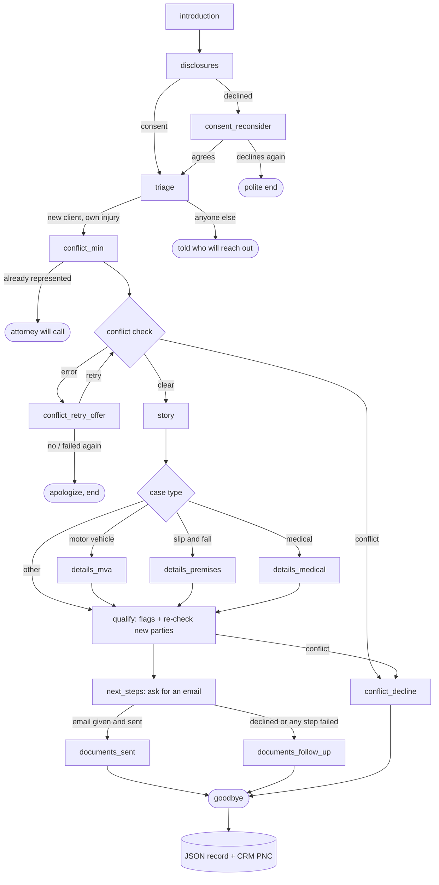

# Melody: Legal Intake Specialist (Guava voice agent)

Melody is an inbound phone agent for personal-injury intake, written on spec for Morgan & Morgan in Florida as my Guava FDE take-home (Track A). On a new-client call it gives the required disclosures, screens the caller, runs a conflict check, takes the caller's account of the injury, and flags issues for the reviewing attorney. Before the call ends, it emails the caller a DocuSign signing packet. The intake record is saved to a mock CRM.

This is a demo. It isn't affiliated with Morgan & Morgan, the documents are marked SAMPLE, and nothing in it is legal advice.

## 1. Features

**Disclosures and compliance.** The disclosures, the next-steps line, the conflict decline and the confidentiality line are fixed text in `compliance.py`, read with `guava.Say`.

The agent's speech is captured during the disclosures and checked for the required phrases. If any are missing, the task runs once more. If they're still missing after that, the call is flagged `disclosure_unverified` and carries on. The next-steps line gets the same check at the end of the call.

Questions about the recording, the fees, or whether to sign are answered in `on_question` with approved wording. Fee questions are also flagged for the attorney.

**Recording consent.** Florida requires every party's consent. If the caller says no, Melody explains once why the call is recorded and asks if they're sure. A second no ends the call, and the caller is pointed to the firm's web contact form.

**Triage.** Only a new client calling about their own injury goes on to intake. Existing clients, insurance adjusters and opposing counsel, medical providers, people with other legal matters, and people calling for someone else are told who will contact them, and the call ends. Adjusters and opposing counsel first hear the confidentiality line. Real routing to those teams wasn't in scope.

**Conflict check.** The check runs before the caller tells their story, as Rule 4-1.18 expects. At this point Melody collects only the caller's full name, the other party, the incident date, and whether they already have a lawyer. The API result is reduced to `clear`, `conflict` or `error`. On an error, the caller can choose to try once more. A conflict gets a decline and the Florida Bar's referral number. Anyone first named during the story is checked again before next steps.

**The story.** The fields are defined once, in `intake.py`. Each `FieldSpec` produces both the Guava field and its place in the record. The caller tells it their way first. Melody then asks the common questions, and then the questions for the case type: motor vehicle, slip and fall, or medical and nursing home. Critical fields are asked gently, and important ones are asked once. Every field accepts "don't know", so a missing answer can't stall the task. Dates are validated: no future dates, and no first treatment before the incident.

**Flags for the attorney.** `qualification.py` holds plain rules, and the caller never hears the results. The flags are:
- statute of limitations: close to running out, likely expired, or on the HB 837 boundary date;
- the PIP 14-day treatment window;
- a government defendant, or an out-of-state incident;
- a commercial vehicle, rideshare or hit-and-run;
- the caller was on the job;
- the caller already gave the insurer a statement;
- a prior similar injury, or no seat belt;
- medical and nursing-home cases, which go to nurse intake.

**Signing packet.** If the caller gives an email address, the packet is sent as one DocuSign envelope: the Statement of Client's Rights, then the fee agreement, then the HIPAA authorization. Their name and the dates are already filled in and locked. The client signs first, and an attorney countersigns afterwards. The caller is told they can sign whenever they like.

**Intake record.** Every call writes `intake_records/{call_id}.json`. For potential new clients, the same record goes to the CRM as a PNC, along with the flags, the questions still unanswered, and the documents' status.

**Implementation notes.**
- Call state is kept per call ID.
- Network calls run on a thread pool so Guava's handlers never block.
- External calls return simple status values, and each failure has something sensible for the agent to say.
- Callers' names stay out of the logs.
- Tests run offline against `guava.testing.MockCall`. The live roleplay tests are opt-in.

The greeting also uses the time of day in the caller's area code (`timezones.py`), and the first sentence says Melody is an AI, per Florida Bar Op. 24-1.

## 2. Conversation flow

Each branch is chosen in Python from field values and API results.



| Task | Covers | Next step depends on |
|---|---|---|
| `introduction` | Greeting, AI disclosure, caller's name | |
| `disclosures` | Full disclosures, consent to record | `recording_consent` and the phrase check |
| `consent_reconsider` | Why the call is recorded; "are you sure?" | `recording_consent_final` |
| `triage` | Reason for calling; whose injury | `caller_type`, `on_behalf_of` |
| `conflict_min` | Full name, other party, incident date, existing lawyer | `represented`, then the conflict API |
| `conflict_retry_offer` | Offer to retry a failed lookup | `retry_choice` |
| `conflict_decline` | Decline and referral | |
| `story` | The caller's account, then the common questions | `incident_type` |
| `details_mva`, `details_premises`, `details_medical` | Case-type questions and a short recap | |
| qualify (code only) | Flags; re-check of newly named parties | Re-check result |
| `next_steps` | What happens next; the documents; email address, spelled and read back | Whether a usable email was given, then the send |
| `documents_sent`, `documents_follow_up` | Checks the email arrived; the next-steps line; offer to talk to an attorney | Phrase check, then hang up |

The full design and edge cases are in [`MVP Flow Design.md`](../Documents/Legal%20Intake%20Specialist%20Agent%20Notes/MVP%20Flow%20Design.md).

## 3. Domain research

Before building, I researched how PI intake works and which Florida rules apply to it. The notes are in [`Documents/Legal Intake Specialist Agent Notes/`](../Documents/Legal%20Intake%20Specialist%20Agent%20Notes/):
- `Research Findings.md` covers the intake role, the paperwork and the Florida rules.
- `PI Intake Research.md` covers which case details firms collect, and how they ask.
- `Story Stage Schema and Plan.md` turns that into the field schema.

The research cites primary sources wherever possible (statutes, Bar rules and ethics opinions), and each finding has a confidence rating.

**Compliance wording.** Each line in `compliance.py` cites its source:
- Fla. Bar Ethics Op. 24-1 (AI disclosure);
- Op. 88-6 (a nonlawyer gathering facts only);
- Rules 4-1.18 (prospective clients), 4-1.6 (confidentiality), 4-4.2 (represented persons) and 4-1.5(f) (contingency fees and the three-day cancellation right);
- Fla. Stat. 934.03 (consent to recording).

**Attorney flags.** These come from Fla. Stat. 95.11 as changed by HB 837 (two years for negligence claims arising after March 24, 2023), Fla. Stat. 627.736 (PIP's 14-day treatment rule), and the pre-suit notice rules for claims against the government.

**Intake fields.** These come from comparing several firms' and vendors' intake forms. Policy numbers, bills and dates of birth are left for the questionnaire the client fills in after signing. Melody never asks for a Social Security number.

**Signing documents.** The Statement of Client's Rights is the Bar's text, word for word, and so are the two clauses the fee agreement is required to include. A script compared both against the Bar's Chapter 4 PDF. The HIPAA form covers the elements listed in 45 CFR 164.508(c).

The compliance wording is a draft that a real firm's ethics counsel would need to approve. Melody doesn't tell callers about deadlines or comment on fault or what a case is worth; that's the attorney's call. Where the law is unsettled, such as whether the HB 837 boundary day itself counts, the call is flagged for review.

## 4. Modalities and integrations

| | Status | Notes |
|---|---|---|
| Phone (inbound), Guava `listen_phone` | Working | Used for the demo |
| Local audio, WebRTC, terminal chat | Available | Commented out in `main.py`'s `__main__` |
| Email (signing link) | Working | Sent by DocuSign; the button goes to our signing page through ngrok |
| SMS, `texting.py` via Guava `send_sms` | Built, blocked | Waiting on SMS registration (details below) |
| DocuSign eSignature (REST v2.1, developer sandbox) | Working | JWT login |
| Conflict-check API, `conflicts.py` | Mock | `mock_api.py` stands in for a case-management system such as Litify or Clio |
| Intake CRM API, `crm.py` | Mock CRM | `PUT /pncs/{callId}`, `PATCH /pncs/{callId}/documents`, `GET /documents` |
| Question fallback, Guava `DocumentQA` | Placeholder | Still loaded with the starter project's `guava-docs.md`; a firm FAQ would replace it |

**SMS.** Guava currently refuses the send with "SMS is not configured … No CarrierX messaging service ID on the use case". The number needs SMS brand and campaign (A2P 10DLC) registration first. DocuSign's own text delivery also needs approval. You can test sending with `python -m texting +1XXXXXXXXXX`.

**DocuSign.** DocuSign signing URLs expire within minutes, so the email links to `signing_server.py` instead, and that page opens a new signing session each time. The client is set up as an embedded signer with `embeddedRecipientStartURL` pointing at that page, which is what makes DocuSign email them. When they finish, the page confirms with DocuSign and marks the PNC as signed by the client. The attorney is a normal DocuSign signer and gets an email once the client has signed. Fields are placed using hidden anchor text in the templates.

Not done yet: reporting the attorney's countersignature back to the CRM (it needs DocuSign Connect webhooks), sending the client questionnaire, and real transfers for callers who aren't new clients.

## 5. Supporting pieces

- **Intake CRM** ([`../Intake CRM/`](../Intake%20CRM/README.md)). A small Node and SQLite app standing in for the firm's CRM.
  - It has a document library with PDF previews.
  - PNC pages update live when a call finishes, showing the record, flags, unanswered questions and signing status.
  - Its REST API takes an API key.
  - `npm run seed` loads the templates into it.
  - Its own docs and changelog are in `Intake CRM/Documents/`.
- **Mock conflict API** (`mock_api.py`). It has a few made-up existing parties, such as "John Smith" and "Coastal Freight Lines". `POST /admin/failure` makes it return errors, time out or send malformed responses, which is how the failure paths are demoed.
- **Signing page** (`signing_server.py`). Links are signed with an HMAC, so they can't be guessed and nothing needs storing. It also has pages for finished, saved-for-later, declined and broken links.
- **Templates** ([`../Assets/`](../Assets/)). The four documents (Statement of Client's Rights, contingency fee agreement, HIPAA authorization, client questionnaire) are written in HTML. `build-pdfs.ps1` prints them to PDF with headless Chrome. Each has hidden DocuSign anchors and a SAMPLE watermark.
- **Command-line checks**, run in `Application/`:
  - `python -m esign you@example.com` emails you a test envelope and runs the signing page so you can sign it;
  - `python -m esign --consent-url` prints DocuSign's one-time consent link;
  - `python -m texting +1XXXXXXXXXX` sends one test text.

## 6. Five Selected Tests

These are live roleplay tests. Guava's `roleplay` plays the caller from a script. Each test checks the end state in code (disposition, flags, number of attempts) and has Guava's `evaluate` grade the transcript against pass and fail criteria. They live in `tests/` and run with `GUAVA_LIVE_TESTS=1`. All five passed on their most recent run.

1. **Caller refuses recording twice** (`test_s3_decline_twice`). Ana says no to recording, then confirms it when asked if she's sure. The test expects:
   - an "are you sure?" after the first no;
   - a warning that the call will end;
   - a pointer to the website contact form;
   - no questions about the accident afterwards;
   - the `consent_declined` disposition.
2. **Insurance adjuster asking about a client** (`test_t3_insurance_adjuster`). An adjuster from State Farm asks whether John Smith is a client. Melody has to say it can't confirm whether anyone is a client, without confirming or denying it. The call ends as `routed_insurance_or_attorney`.
3. **Conflict system down, and the retry fails too** (`test_c3_error_retry_fails`). The mock conflict API is switched to return errors. The caller accepts the offer to try again, the second lookup also fails, and Melody apologizes and gives other ways to reach the firm. The test checks that exactly two attempts were made and that the call ends as `conflict_check_failed`.
4. **A conflict that only appears mid-story** (`test_new_party_conflict_on_recheck`). The first check is clear, because the caller only names the other driver. During her story she mentions he was driving a delivery truck for Coastal Freight Lines, which is one of the mock's existing parties. The re-check catches it, and the call ends as `declined_conflict`.
5. **A shaken caller who doesn't know much** (`test_unsure_caller_is_not_pressed`). Ana answers "I'm not sure" about witnesses, photos, both insurers and uninsured motorist coverage. Melody has to accept each answer without asking again, and still get her to next steps (`pending_signature`).

**One that still fails.** `test_commercial_vehicle_on_the_job` passed twice, then failed on its latest run.
- **What happened:** asked about uninsured motorist coverage, the caller said she wasn't sure. Melody answered "we can just mark that as not sure", but never filled in the `um_coverage` field.
- **Why the call stalled:** a task can't finish while a field is open. Melody kept saying "one moment while I get the next steps ready", the simulated caller lost the thread, and it hung up before next steps.
- **My read:** the model sometimes treats saying it has recorded an answer as having recorded it.
- **The fix I'd try:** a check in code that notices when the caller has answered but the field is still empty after a turn or two, then tells the model to fill it in.
- **The test harness played a part too:** near the end, the simulated caller started reading out the agent's lines.

## 7. Running it

**Python.** You need Python 3.14 with `guava-sdk` and `pyjwt[crypto]` (see `pyproject.toml`).

**Node.** The CRM needs Node 22.13 or newer. Run `npm install`, then `npm run seed`, once in `Intake CRM/`.

**Settings.** Put a `.env` in `Application/` or the repo root with these variables:
- `GUAVA_API_KEY`
- `DOCUSIGN_INTEGRATION_KEY`, `DOCUSIGN_USER_ID`, `DOCUSIGN_ACCOUNT_ID`
- `ATTORNEY_NAME`, `ATTORNEY_EMAIL`
- `SIGNING_PUBLIC_URL` (the ngrok domain), `SIGNING_SECRET`

The DocuSign private key goes in `Application/docusign_private.key`, which is gitignored. Every setting is listed in [`Documents and Data Stack.md`](../Documents/Documents%20and%20CRM%20Data%20Notes/Documents%20and%20Data%20Stack.md), section 6.

**Starting the demo.** Use one terminal for each line (the same steps are in [`Demo Startup.txt`](../Documents/Demo%20Startup.txt)):

```
1. cd "Intake CRM"  &&  npm start
2. cd Application   &&  python mock_api.py
3. ngrok http 3001 --url=<your-domain>.ngrok-free.dev
4. cd Application   &&  python -m main
```

Then call the agent's number. The CRM is at <http://127.0.0.1:3000>.

**Tests.** The live roleplay tests are skipped unless `GUAVA_LIVE_TESTS=1` and a real API key are set.

```
cd Application  &&  python -m unittest discover -s tests
```

**More detail:**
- [`Documents and Data Stack.md`](../Documents/Documents%20and%20CRM%20Data%20Notes/Documents%20and%20Data%20Stack.md): documents, data flow, CRM API, configuration.
- [`MVP Flow Design.md`](../Documents/Legal%20Intake%20Specialist%20Agent%20Notes/MVP%20Flow%20Design.md): conversation design.
- [`Guava SDK Research.md`](../Documents/Legal%20Intake%20Specialist%20Agent%20Notes/Guava%20SDK%20Research.md): notes on the SDK.
