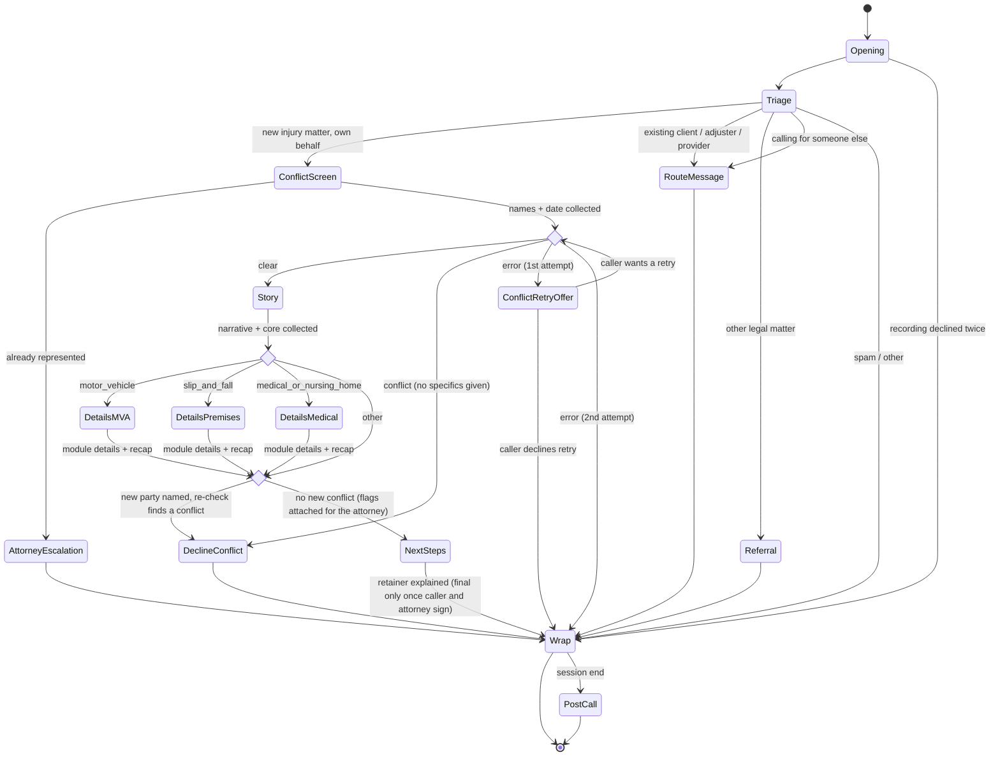

# Legal Intake Agent: Flow Design and MVP Outline

**Date:** 2026-10-07
**Status:** Draft for review. To be stress-tested with `/grill-with-docs` before implementation.
**Builds on:**
- `Research Findings.md` (domain), cited as **RF §x**
- `Guava SDK Research.md` (SDK 0.47.0), cited as **SDK §x** and **P#** (its pattern numbers)

**What this is:** the revised intake flow (8 stages), each stage expanded with domain detail, mapped to concrete Guava primitives, then arranged into a state-transition graph with steering techniques for its edges. Part 6 draws the MVP cut line.

**Conventions:**
- **Model** means the Guava dialog LLM.
- **Code** means our Python Expert (the handlers).
- `ASSUMED` marks an SDK behavior that is not yet verified (see SDK §7).
- Mock APIs are ours, stood up for the demo. The brief allows this.

---

## Part 1: The eight stages, with domain detail

### Stage 1: Opening
**Goal:** lawful, warm start.
- **Required content (all three are legal, not stylistic):**
  - **AI disclosure.** Opinion 24-1 requires telling the prospect they are talking to an AI, not a lawyer or employee. It also warns against an "overly welcoming" persona. (RF §4.3)
  - **Nonlawyer status.** Opinion 88-6 requires intake to identify as a nonlawyer and to ask only for facts. (RF Key takeaway 1)
  - **Recording consent.** Florida requires all-party consent to record (Fla. Stat. 934.03). An unlawful recording is a felony. (RF §4.4)
- **Also:** the firm greeting, the caller's name, and a language choice. Spanish matters in Florida (SDK §1.16). It is out of MVP scope.
- **Tone:** empathetic but not salesy. Many callers are hurt or shaken (RF §1.1 #6).

### Stage 2: Triage
**Goal:** answer one question: is this a new potential client (PNC) with an injury matter, or someone else?
- **Caller types and routes** (RF §1.4):

  | Caller type | Route |
  |---|---|
  | New PNC, about their own injury | Continue to Stage 3 |
  | Calling for someone else | Message to the intake team (MVP decision). The claimant (or the estate's personal representative) must be the signer, so the team arranges contact with them. |
  | Existing client | Case team / message. **No case details discussed.** |
  | Insurance adjuster or opposing counsel | Message only. **No client information**, because of confidentiality (Rule 4-1.6). |
  | Medical provider or lienholder | Case team / message |
  | Wrong practice area | M&M handles 30+ case types, so route internally if possible. Otherwise refer, e.g. to the Florida Bar Lawyer Referral Service, 800-342-8011. |
  | Spam or vendor | End politely |

- **Already represented?** Ask early. Opinion 24-1 recommends screening for represented persons. Rule 4-4.2's comment allows talking to someone seeking a second opinion. If yes, escalate to an attorney. (RF §1.4)

### Stage 3: Conflict screen
**Goal:** clear conflicts **before** hearing the story.
- **Why first:** under Rule 4-1.18, anything a prospect says is confidential even if the firm declines, and it can disqualify the firm. Collect only what is "reasonably necessary" to check conflicts and fit. (RF §4.2)
- **Minimum data:**
  - caller's full name
  - injured person's name, if different
  - adverse parties (the other driver, the business, the employer)
  - incident date (also used by the deadline logic)
  - "Have you spoken with or hired another lawyer about this?"
- **The caller needs one sentence of explanation**, e.g. "so we can make sure we're able to help you", or asking for adverse names feels odd. (P6)
- **Outcomes:**
  - **clear** → proceed
  - **conflict** → decline **without giving a reason**, which would disclose another client's information
  - **check failed** → never imply that it passed

### Stage 4: Fact gathering
**Goal:** the caller's story in their own words, then only the missing specifics.
> **Superseded in detail by** `PI Intake Research.md` (what is collected on the call and why) and `Story Stage Schema and Plan.md` (fields, tiers, record). The list below is the original outline.
- **First-call questions M&M publishes** (RF §2.1): what happened; where and when; who was affected and involved. Then medical, insurance and evidence.
- **Core PI facts** (RF §1.5, §2.1):
  - incident type, location (county, for venue)
  - how it happened
  - injuries and whether there was ER, hospital or ongoing treatment
  - **date of first treatment** (PIP requires treatment within 14 days)
  - police report (yes / no / not sure)
  - photos and witnesses
  - the caller's insurance and the other side's insurer
  - lost work
  - **for motor vehicle accidents:** driver / passenger / pedestrian, and vehicle details
  - **for premises cases:** type of premises, and whether it was reported to the owner
- **Re-check trigger:** if the story names a *new* party (the other driver's employer, a second business), the conflict check has to run again for that name (Rule 4-1.18 logic).
- **Never:** comment on fault, case strength, or value (Rule 4-7.13(b)(1); RF §3).

### Stage 5: Qualification
**Goal:** turn facts into **flags for the attorney**. It is not a verdict. Intake does not decide acceptance (RF §3).

| Factor | Florida specifics | Flag examples |
|---|---|---|
| Liability | Modified comparative fault: a plaintiff more than 50% at fault recovers nothing (Fla. Stat. 768.81(6); does not apply to medical negligence) | `caller_may_be_at_fault` |
| Damages | Severity, treatment, lost wages | `no_treatment`, `serious_injury` |
| Collectability | At-fault coverage, plus the caller's own PIP and uninsured-motorist (UM) coverage | `no_insurance_known` |
| Limitation period | Fla. Stat. 95.11(5)(a): **2 years** for negligence accruing after 2023-03-24; **4 years** for claims accruing on or before it (RF §4.1). The exact boundary day is unsettled (RF open questions). | `sol_expired_likely`, `sol_urgent` (e.g. under 90 days left), `sol_boundary_case` |
| Special notice | Government defendant: written notice within 3 years | `government_defendant` |
| Special screening | Medical malpractice or nursing home goes to **nurse intake** (RN). Wrongful death has its own rules. | `route_nurse_intake`, `wrongful_death` |
| PIP | No treatment within 14 days limits PIP | `pip_14_day_risk` |
| Prior representation | Already has a lawyer | `represented` |
| Jurisdiction | Florida incident, or another state | `out_of_state` |

**Critical rule:** these flags go **only** into the attorney summary and into routing. The caller never hears a calculated deadline. The declination guidance is to warn generically that time limits apply, without computing one (RF Key takeaway 11, §2.7).

### Stage 6: Next steps and retainer
**Goal:** close the intake warmly and honestly. The caller leaves knowing what happens next, and that nothing is final until an attorney signs.

**Decided (replaces the earlier "attorney decision" options).**
- A live attorney decision on the call was dropped, whether by API with a hold or by warm transfer. Simulating it in a demo makes it look like the AI decides, and it doesn't fit most firms' flows.
- **The attorney's countersignature is the acceptance.** Florida requires the lawyer's signature on a contingency agreement (Rule 4-1.5(f)), so no agreement exists until a lawyer signs.
- This also matches practice: M&M's intake specialists, not attorneys, send and collect retainers by email or text (RF §1.1 #5).

**When:** the post-story re-check finds no new conflict, and all details are collected.

**Terminology:** the document is Florida's **contingency fee agreement** (Rule 4-1.5(f)), which firms and callers call the **retainer**. In speech, the agent says "fee agreement" or "retainer agreement".

**The agent:**
1. **Thanks them for the process, not the merits.** "Thank you, you've given us what the attorney needs to review your situation." Avoid lines like "things are looking good", which a caller can hear as a prediction (Rule 4-7.13(b)(1)).
2. **Explains the next steps** (RF §3, Key takeaway 9):
   - an attorney will review their information;
   - if the firm takes the case, an attorney and team are typically assigned within about a week;
   - what to gather in the meantime: photos, the police report number, medical records, insurance cards.
3. **Explains the documents, in the required order** (Rule 4-1.5(f)(4)(C); RF §2.5):
   - first, a **Statement of Client's Rights**, which they should read in full before anything else. It's signed by them and by a lawyer.
   - then the **fee agreement**, which they can sign **whenever they're ready**, with no pressure.
4. **States two facts verbatim:**
   - "An attorney will review everything and decide whether the firm can take your case; the agreement is only final once both you and a Morgan and Morgan attorney have signed it."
   - "It also gives you three business days after signing to cancel in writing."
   These address RF §3 ("must say in plain terms that an attorney decides") and the mandatory cancellation clause (4-1.5(f)(4)(A)(ii)). Stating them is not interpreting them.
5. **Offers an attorney for questions before signing.** "If you have any questions about the statement or the agreement before you sign, an attorney can go over them with you." This matches M&M, where the Intake Attorney gives "attorney-level reassurance before the retainer is signed" (RF §3).

**Constraints** (RF §3, "What intake can and cannot say"):
- No explaining or interpreting the Statement or the fee terms, and no answering "should I sign?" (Op. 88-6). Those questions go to an attorney.
- No promise or implication that the firm has accepted the case, that it will succeed, or what it's worth (Rule 4-7.13(b)(1)).
- No promises of financial help, such as paying medical bills or advances (Rule 4-1.8(e) allows only court costs and litigation expenses).
- "Does this cost me anything?" is answered only from approved FAQ wording, never characterized freely.
- **Known risk:** a caller may feel "signed up" before an attorney has reviewed the case. The verbatim line in step 4 addresses it.

**Disposition at end of call:** `pending_signature` (the caller hasn't signed and the attorney hasn't countersigned). This is one of the standard intake dispositions (RF §2 implications).

**Attorney's side (after the call, human):** review the intake summary and flags, then either:
- countersign the Statement and the agreement, after which the client receives a signed copy (4-1.5(f)(2)) and the 3-business-day cancellation window runs from signing; or
- decline with a non-engagement letter (Stage 7, RF §2.7).

### Stage 7: Outcome
**Goal:** every call ends in a defined disposition.

**Sign-up path** (RF §2.4, §2.5):
- Florida PI contingency fees require:
  1. the **Statement of Client's Rights**, signed by client *and* lawyer **before** the contract;
  2. a **written contract** signed by client and lawyer, containing the two mandatory clauses;
  3. a **3-business-day written cancellation right**;
  4. fee schedule caps.
- M&M intake delivers retainers by **email or text** (RF §1.1 #5).
- The agent **must not explain or interpret the fee terms** (Opinion 88-6). Questions about the documents go to an attorney.
- **Open question:** whether the Statement can be e-signed has no Bar ruling (RF open questions).

**Other outcomes:**
- **Decline:** gentle wording, no opinion on the merits, a generic "time limits apply, consult another lawyer promptly", and a written **non-engagement letter** to follow. The person still goes into the conflict system (RF §2.7).
- **Pending:** the caller hasn't signed yet, or the attorney hasn't countersigned yet. This is the normal state at the end of the call, and the firm follows up after it.
- **Referral:** wrong practice area or out of state.
- **Routed:** non-PNC callers (Stage 2).

**Logistics** (part of Stage 7):
- confirm the best callback number and time
- tell the caller what to gather: photos, police report number, medical records, insurance cards
- what happens next: per M&M, an attorney and team are assigned within about a week (RF Key takeaway 9)
- answer FAQs from approved wording only

### Stage 8: Post-call documentation
**Goal:** the human team gets a complete, reviewable package (RF §2, "Must produce").

| Document | Contents | Destination (production) |
|---|---|---|
| Intake / lead record | Structured fields; marketing source; timestamps | Intake CRM (Litify / Salesforce at M&M) |
| Conflict-check record | Names checked, result, time | Conflict system |
| Attorney summary memo | Facts, liability, injuries and treatment, insurance, limitation flags, red flags, recommendation | Intake Attorney queue |
| Disposition | signed / pending signature / declined / referred / routed / not a prospect | CRM |
| Non-engagement letter (declines only) | No relationship formed; no merits opinion; generic time-limit warning; see another lawyer | Mailed or emailed; copy to file |
| Follow-up task (pending only) | Who, when, why | CRM task |

For an AI agent, documentation and data entry collapse into a single step: the call produces structured state, and code renders every document from it.

---

## Part 2: Each stage in Guava API terms

**Shared design:**
- One **generic** `@agent.on_task_complete` router `(call, task_id)` owns all transitions (SDK §1.3: generic and per-task handlers can't be mixed).
- Per-call state lives in a dict keyed by `call.id`. **Never globals**, because concurrent calls would share them (SDK §1b misuse #4).
- All I/O goes through a thread pool, because handlers dispatch serially (SDK §1.1, P0).
- External calls return a normalized `{"status": ok|not_found|error|timeout}`, and the model never sees raw API text (P10).

### Stage 1: Opening
- **`@agent.on_call_start`:**
  - No I/O here. Pickup waits for this handler (SDK §1.1).
  - `call.read_script(OPENER)` speaks the disclosures verbatim. `read_script` is documented as the first words before any LLM turn (SDK §1.6).
  - `call.set_task("opening", objective="Learn the caller's name and how to address them.", checklist=[Field(key="caller_name", field_type="text")])`.
- **Persona:** `guava.Agent(name=..., organization="Morgan & Morgan", purpose="AI intake assistant; gathers facts only; never gives legal advice; confirms it is an AI if asked", voice="grace")` (SDK §1.2).
- **Telemetry:** set `GUAVA_DISABLE_TELEMETRY=true` (SDK §1.12).

### Stage 2: Triage
- **Task `triage`:**
  - `Field(key="caller_type", field_type="multiple_choice", choices=["new_injury_matter","existing_client","insurance_or_legal","medical_provider","other_legal_matter","other"])`
  - `Field(key="on_behalf_of", field_type="multiple_choice", choices=["self","family_member","other"])`
  - `multiple_choice` values are guaranteed to be one of the choices (SDK §1.4), so code can branch on them safely.
- **Router:** `if caller_type != "new_injury_matter"` → `set_task("take_message", …)` or a referral `Say`, then `call.hangup(...)` (a soft hang-up, i.e. an instruction; SDK §1.6).
- Do **not** branch on `IntentRecognizer` output. It returns a list, which is the broken pattern in the starter repo's legal example (SDK §1b).

### Stage 3: Conflict screen
*(Updated to match the build.)*
- **Task `conflict_min`:** `caller_full_name` (spell the last name), `adverse_parties` (text, `required=False`), `incident_date` (`field_type="date"`, returns `{year, month, day}`), and `represented` (`multiple_choice` yes/no/not_sure). There is no `injured_party_name`, because only callers phoning about their own injury reach this stage.
- **`@agent.on_validate("incident_date")`:** rejects future or invalid dates, which triggers an automatic `retry_task` (SDK §1.4).
- **On completion:**
  - **`represented == "yes"`** → flag it and go to the attorney-escalation stub. No check runs.
  - Otherwise the handler submits the check to the pool and returns immediately (no holding task; Part 4 #5). An unknown adverse party means the check runs on the caller's name only, with an `adverse_unknown` flag.
  - The worker normalizes the result to clear / conflict / error and branches:
    - **clear** → Story
    - **conflict** → the `conflict_decline` task. It's sympathetic: an understandable reason (conflict-of-interest rules) comes before the conclusion. It never says who, then gives the generic time-limit warning and the Florida Bar referral line.
    - **error (1st)** → the `conflict_retry_offer` task: an apology plus an offer to try once more.
    - **error (2nd), or the caller declines the retry** → a kind ending that suggests calling back later or forthepeople.com.

### Stage 4: Fact gathering
*(Revised again: the core is one task, plus one case-type module task. Spec: `Story Stage Schema and Plan.md`.)*
- **Task `story`.** The checklist runs:
  - a bridge `Todo` inviting the caller's account;
  - the open `narrative` field;
  - a bridge `Todo` ("thank them, say you have a few questions, confirm rather than re-ask");
  - the **core** fields from `intake.CORE`.
- **Module choice (code, on `incident_type`)** picks `details_mva`, `details_premises` or `details_medical`. `other` has no module. Each details task holds only its module's fields and ends with a recap `Todo`.
- **Why the split:** the field count roughly doubled after the intake research, and about half the fields depend on the case type. A code branch on a typed field replaces many "choose not_applicable without asking" descriptions. The module task shares the conversation, so it confirms what the caller already said instead of re-asking. If live tests show re-asking, the fallback is one task with the module's fields chosen in code.
- **Tiers drive the questioning** (`guava_field` in `main.py`):
  - **critical:** required; "unsure" is a valid answer;
  - **important:** optional, asked once.

  Every field has a "don't know" answer: `not_sure`, `"unknown"`, or the caller's best estimate. A field that can't be resolved stalls the task, and Guava waits until every checklist item is resolved. That also ruled out a "record only if volunteered" tier (spec §1.1, live findings).
- **Corrections** ("actually it was Tuesday") happen inside the task. They are not a graph edge.
- **New parties** named in the story go in an optional `other_parties` field, which the `qualify` diamond re-checks.
- **Risk to watch:** the model may start asking detail questions before the caller has finished their story. The narrative field's guidance tells it to let them finish.

### Stage 5: Qualification
- **Pure Python. No model, no task.** It is the `qualify` diamond, which runs after the `story` task. It first re-checks conflicts for any newly named parties (Part 3, re-check failure policy).
  - `limitation_flags(incident_date, incident_type, today)`
  - `pip_flag(incident_date, first_treatment_date)`
  - rule tables for `route_nurse_intake`, `government_defendant`, `out_of_state`
- The results go into `state["flags"]` and the attorney summary. **Nothing is spoken.**
- **No hard routes in the MVP.** Every flag, including `route_nurse_intake` for medical malpractice / nursing home and `sol_expired_likely` / `sol_boundary_case` (marked urgent), goes to the attorney, who decides after the call. Nothing auto-declines.

### Stage 6: Next steps and retainer
- **Task `next_steps`**, set by the `qualify` diamond when the re-check finds no new conflict. The checklist follows Part 1 Stage 6:
  1. Bridge `Todo`: process-only thanks ("you've given us what the attorney needs to review your situation"). No merit-sounding phrases.
  2. Next-steps `Todo`s: an attorney reviews their information; if the firm takes the case, an attorney and team are typically assigned within about a week; what to gather (photos, police report number, medical records, insurance cards).
  3. Documents `Todo`: first a Statement of Client's Rights to read in full, then the fee agreement to sign whenever they're ready, with no pressure.
  4. `Say` (verbatim): "An attorney will review everything and decide whether the firm can take your case; the agreement is only final once both you and a Morgan and Morgan attorney have signed it. It also gives you three business days after signing to cancel in writing." Code phrase-checks it (e.g. "attorney", "decide", "final", "three business days") with the same pattern as the disclosures.
  5. `Todo`: offer an attorney for any questions about the statement or agreement before signing.
- Fee or agreement questions, and "should I sign?", get the approved deflection ("an attorney can go over any questions about the agreement with you"). The call is flagged `fee_questions`.
- **Disposition** `pending_signature` is set when the task is set, not on completion, so it holds even if the call ends early (the lesson from the conflict retry offer).
- How the documents are delivered (texted during the call vs emailed after) is decided in Stage 7.

### Stage 7: Outcome
**Built** (see `../Documents and CRM Data Notes/Documents and Data Stack.md`, section 3):
- **`next_steps`:** asks for an email address for the documents, spelled and read back, or "none".
- **`send_documents` (worker):** builds one DocuSign envelope from the CRM's templates (Statement → fee agreement → HIPAA). The client signs first and is embedded; the attorney countersigns second, by email. DocuSign then emails the caller, and the email's button opens our signing page (`embeddedRecipientStartURL`).
- **`documents_sent`:** confirms the email arrived, then the verbatim line.
- **Why email, not text:** texting was built first, but Guava refuses SMS until the number's SMS brand and campaign registration is approved. `texting.py` is kept for when it is.
- **`documents_follow_up`:** "the team will send them", plus the `documents_not_sent` flag.
- **No signature-watching on the call:** the caller signs whenever they're ready, and the CRM shows `client_signed` once they do.

*The notes below are the original design, kept for history.*
- **`signup`:**
  - `Field(key="text_ok", multiple_choice)` and a confirmed mobile number. Use `call.call_info.from_number` if it is a phone call (SDK §1.6).
  - The worker creates the e-sign envelope (mock, or a DocuSign / Dropbox Sign sandbox) with the **Statement first, then the contract**.
  - Then `guava.Client().send_sms(from_number, to_number, message)` (SDK §1.10).
  - Then `send_instruction` stating facts only ("a text was just sent to the number ending 1234").
  - Then `set_task("esign_wait", checklist=[Field(key="link_received", …)])`.
  - The worker polls signing status. On signed → `send_instruction` with a confirmation. On timeout → the link stays valid → `logistics`.
  - Fee questions → the approved line "an attorney will go over any questions about the agreement" → flag `fee_questions`.
  - **Prerequisite:** SMS needs A2P 10DLC registration (SDK §1.10). Have an email fallback ready.
- *(Revisit when Stage 7 is designed. The `signup` / `esign_wait` mechanics above predate the Stage 6 rewrite. Declines now happen after the call, by the attorney, with a non-engagement letter, and the logistics content has moved into `next_steps`.)*

### Stage 8: Post-call
- **`@agent.on_session_end`:**
  - Read every field (fields survive hang-ups; SDK P10). Build the record and submit to the pool:
    - `POST /leads` (idempotent on `call.id`)
    - render the summary memo, disposition and, if declined, the non-engagement letter
  - Abandoned calls get a `partial_intake` disposition plus a follow-up task.
  - **Implemented (MVP stand-in):** `write_intake_record` writes `intake.build_record(...)` to `Application/intake_records/{call_id}.json`. For potential new clients it also sends the record to the mock intake CRM (`crm.upsert_pnc`, `PUT /pncs/{call_id}`, idempotent on the call ID), where it shows as the PNC's profile. There is no memo rendering yet. See `../Documents and CRM Data Notes/Documents and Data Stack.md`.
  - **No `call.*` commands here** (SDK P10).
- **Transcript:**
  - Accumulate `on_caller_speech` / `on_agent_speech` per `call.id`, collapsing partials by `utterance_id` (SDK §1.12).
  - Alternatively, fetch it later from the Conversations API.
  - The Conversations API has **no** field values, so our own record is the source of truth.

---

## Part 3: State-transition graph

### Graph conventions
1. **A state is one Guava task**: something the caller is in a conversation with. States are named after what the caller experiences.
2. **A diamond (`<<choice>>`) is a code decision**: API calls and rule evaluation. It is never spoken, and from the caller's side it is instant.
3. **An edge exists only where code calls `set_task` or `hangup`.** Anything the model does *within* a task (asking for a missing fact, accepting a correction, a follow-up question) is not an edge.
4. **Every edge condition is a typed field value or a code result**, never the model's free-text judgement.

**The `qualify` diamond**, in order:
1. Re-check any parties the story named that weren't checked before.
2. Compute the flags: deadline, PIP 14-day, government defendant, out of state, no treatment, and `route_nurse_intake` for medical malpractice / nursing home.
3. Route to DeclineConflict or NextSteps. Those are the only two exits: intake never declines on the merits.

Nothing in it is spoken.

**Main path:** Opening → Triage → ConflictScreen → Story → DetailsMVA → NextSteps → Wrap. Everything else is a side exit. The attorney's decision (countersign, or decline with a non-engagement letter) happens after the call, by a human.

**Re-check failure policy.** The first conflict check gates *what we hear*, so if it fails, intake stops. The re-check runs *after* the story has been heard, so blocking would protect nothing and would only lose the lead. A failed re-check therefore becomes a `recheck_failed` flag that the attorney sees before deciding. A re-check that finds a **conflict** still declines, with the same sympathetic decline as the first check.

**Still to restate under the conventions:** in the MVP, `RouteMessage` and `Referral` are currently placeholder hang-ups, not tasks.

### Global interrupts
These can happen from any state, so they are modeled as overlays rather than edges:

| Interrupt | Detection | Effect | Resumes? |
|---|---|---|---|
| **Emergency** ("not breathing", "chest pain"…) | Code: keyword pass in `on_caller_speech` (P4) | Verbatim 911 line (`read_script`, ASSUMED to work mid-call), then a safety check | Only if the caller confirms they're safe; otherwise `Wrap` |
| **Asks for a human** | `on_escalate` (requested_by=`human`) | MVP: a placeholder hang-up ("a member of the intake team will call you back"). Later: transfer to the intake team during business hours | No |
| **Agent gives up** | `on_escalate` (requested_by=`agent`) | Same as above. Override the default "apologize and hang up" (SDK §1.5) | No |
| **Distress / grief** | Code: keyword plus interruption counter (P2) | Switches **mode**, not state: slower persona, acknowledge-first wording, fewer required fields, offer a callback | Yes, same state |
| **Legal-advice or case-value question** | Model calls `on_question`, or a `send_instruction` guard | Approved deflection ("an attorney can speak to that") | Yes, same state |
| **FAQ / off-topic** (hours, fees, "is this free?") | `on_question` answered from approved FAQ text | Answer, then steer back. 3-strike nudge. | Yes |
| **"Are you a robot?"** | Persona instruction | Honest yes, offer a person | Yes |
| **Silence** | Code watchdog (no SDK event; P11) | "Are you still there?" → callback-and-end at ~45 s | Yes, or `Wrap` |
| **Caller hangs up** | `on_session_end` (user-hangup) | Persist partial intake, `partial_intake` disposition, follow-up task | — |

---

## Part 4: Steering techniques for the edges

**1. Code owns the state machine; the model owns the sentences.**
A transition table `(state, event/result) → next_state` lives in the generic `on_task_complete` router and in the pool workers. Each state is a **task factory**, a function that builds `set_task` arguments from current knowledge. The model never chooses the next state. This is the brief's "structure in deterministic code" idea, applied directly.

**2. Bridge lines are `Todo`s, not `Say`s.**
Each new task starts with a plain-string checklist item that tells the model *what kind* of transition to make ("Thank them for sharing that, and say you have a few specific questions"). The model phrases it in context, so it never sounds canned. `Say` (verbatim) is kept for legally exact text only (SDK §1.3; the docs advise using it sparingly).

**3. Ask only for what's missing.**
Every task factory filters its checklist by `call.get_field(k) is None` *and* by facts extracted from the narrative. When a fact is only *probably* known (inferred from the story), ask for **confirmation** instead of asking the question again ("you mentioned this was on I-4, is that right?"). That is how a good human sounds. `add_info("known_so_far", ...)` at each transition gives the model what it needs to refer back.

**4. Overlay detours vs. real departures.**
Brief detours (an FAQ, a moment of empathy, an advice deflection) use `send_instruction` and **do not replace the task**, so the conversation picks back up where it was. Real departures (emergency, escalation) use `set_task`. For departures that can resume, the router keeps a **resume record** (state id plus remaining fields) and re-issues the task afterwards with only the remaining fields: "Thanks for bearing with me. Where were we: you said the other driver…"

**5. Holding states do useful work (deferred).**
Never leave dead air while an API runs. A holding task would collect procedural, non-substantive items (callback number, text consent, referral source) while a slow API runs, with an objective that forbids implying any result. **Not in the MVP:** the conflict check runs on a background thread with a short timeout, and the model's own transition filler covers the wait. Revisit if a real API is slow enough to cause dead air, which brings back the race where the caller finishes before the result arrives (P6).

**6. Transitions are guarded by predicates.**
Code refuses to enter `Story` until `conflict == "clear"`, and refuses to enter `NextSteps` (the retainer) until the post-story re-check finds no conflict. These guards are the review's code-vs-model talking point: they **cannot** be talked past, because no prompt grants the transition.

**7. Loop limits on every back-edge.**
Per-state visit counters and per-field retry counters live in state:
- `ConflictRetryOffer → conflict_check`: at most 1 retry.
- `on_validate`: on the 3rd failure, accept the value with `needs_review` (or offer keypad entry for digits) (P11).
- When a limit is hit, end kindly (`Wrap`), never round again.

**8. Mode flags change *how* every later task is phrased, not *which* task comes next.**
`distress`, `grief` and `rushed` are flags that task factories read: slower `set_persona(speech_speed=...)`, acknowledgement-first `Todo`s, more fields set `required=False`, and a callback offered. The graph stays the same while the call feels different.

**9. Let the caller jump ahead, but don't follow them.**
A caller who asks "can I just sign?" during fact gathering gets a promise ("we'll get you there in just a minute"), via `send_instruction`, not a state jump. Every guard stays in force.

**10. Outcome wording is pre-approved; the model only delivers it.**
Declines, conflict declines, referrals and fee-question deflections are firm-approved text, passed as `Say` (exact wording) or as tightly scoped `Todo`s. The model adds warmth, not content.

---

## Part 5: Integration surface (one mock service for the demo)

| Endpoint | Real-world analogue | Failure modes to demo |
|---|---|---|
| `POST /conflicts/check` | Firm conflict system (Litify / Clio contacts) | conflict hit, timeout, malformed JSON |
| `POST /esign/envelopes` + `GET /esign/{id}` | DocuSign / Dropbox Sign | create fails, never signed |
| `POST /leads` | Litify / Salesforce lead + disposition | 5xx on write (retry idempotently on `call.id`) |

One mock server with a failure-injection switch (query flag or env) lets the onsite demo trigger each hard path on cue (P10).

---

## Part 6: MVP cut line

**In the MVP:**
- Opening with the three disclosures (English)
- Triage, with every non-PNC type routed to a message
- Conflict screen, async check and retry offer (holding task deferred)
- Story plus dynamic details for **motor vehicle accidents** (the highest-volume case type)
- Qualification flags in code: deadline, PIP 14-day, represented, nurse-routing flag
- Next steps and retainer: the agent explains next steps and the retainer (final only once caller and attorney sign); delivery mechanism per Stage 7
- Post-call record, summary memo, disposition, and non-engagement letter rendered from state
- Interrupts: emergency, human request, legal-advice / case-value deflection, FAQ
- The mock service with failure injection
- 5–12 test scenarios (SDK P12)

**Deferred, with reasons (for the README):**

| Deferred | Why |
|---|---|
| Spanish | High value in Florida. Needs keypad language selection plus Spanish disclosure scripts (P7). First item for the next 8 hours. |
| Slip-and-fall, premises, wrongful-death branches | The branch mechanism is identical. Adding a case type is a data change, not new code. Wrongful death needs grief-specific design. |
| Real-time attorney decision on the call (warm transfer or attorney-desk API) | No transfer-failure event in the SDK, and a simulated attorney decision looks like the AI deciding. The attorney's countersignature after the call is the acceptance instead. |
| Nurse-intake routing for medical malpractice / nursing home | M&M routes these to RN screeners (RF §1.1 #7). Out of the car-accident MVP scope, so it is kept as a flag for the attorney. |
| Silence watchdog | The Dialog System's own silence behavior is unknown. Measure it before building on top (SDK §7). |
| Unsigned-lead follow-up campaigns | Outbound requires separate registration. Inbound-only also keeps solicitation-rule risk at zero (RF §4.5). |
| Real Clio / Litify integration | Access requirements are unclear. A Clio-shaped mock shows the integration pattern. |
| Distress detection beyond a basic keyword and interruption counter | Crude detection makes false positives likely. Tune it against real transcripts. |

---

## Open decisions (for `/grill-with-docs`)
1. ~~**The attorney-decision mechanism.**~~ Decided: the attorney's countersignature after the call is the acceptance (Stage 6).
2. **The exact minimal conflict data set.** Is asking for adverse-party names before the story acceptable to callers?
3. ~~**Is SMS feasible?**~~ Not without Guava's SMS brand and campaign registration, so documents go by email (Stage 7).
4. **The deadline boundary:** whether to flag incidents within ±1 day of 2023-03-24 as `sol_boundary_case` for attorney review.
5. **How the Statement of Client's Rights is signed:** e-signature in the same envelope, ordered before the contract? There is no Bar opinion on e-signing it.
6. **Recording/AI disclosure wording,** and whether to continue if the caller **refuses** recording consent. Options: stop recording (no SDK switch exists; SDK §1.12), switch to message-taking, or end the call.

## Experiments to run first (they unblock the design)
1. Does `read_script` speak verbatim and promptly **mid-call**? The emergency and Spanish patterns depend on it.
2. Does the model fill later checklist fields from information volunteered early, and does it skip fields already collected in earlier tasks?
3. What does a task transition sound like: a pause, or a natural bridge?
4. How much delay does a slow handler add? Is the holding pattern actually necessary in practice?
5. ~~Can the sandbox number send SMS today?~~ No: `400 SMS is not configured on +14843040566. No CarrierX messaging service ID on the use case.`
