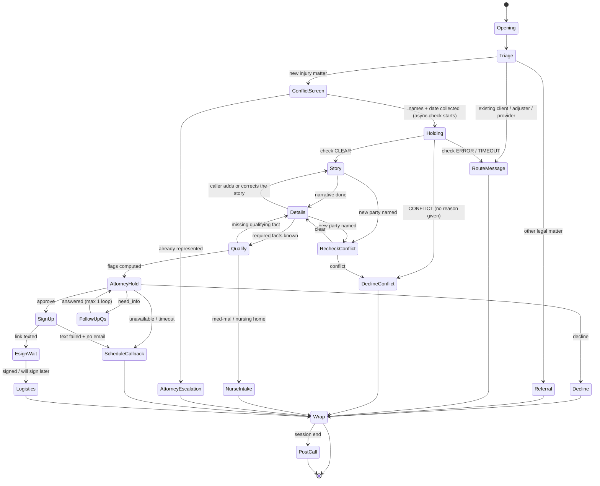

# Legal Intake Agent: Flow Design and MVP Outline

**Date:** 2026-10-07
**Status:** Draft for review. To be stress-tested with `/grill-with-docs` before implementation.
**Builds on:**
- `Research Findings.md` (domain), cited as **RF §x**
- `Guava SDK Research.md` (SDK 0.47.0), cited as **SDK §x** and **P#** (its pattern numbers)

**What this is:** the revised intake flow (8 stages), each stage expanded with domain detail, mapped to concrete Guava primitives, then arranged into a state-transition graph with steering techniques for its edges. Part 6 draws the MVP cut line.

**Conventions:**
- **Model** means the Guava dialog LLM.
- **Code** means our Python Expert (the handlers).
- `ASSUMED` marks an SDK behavior that is not yet verified (see SDK §7).
- Mock APIs are ours, stood up for the demo. The brief allows this.

---

## Part 1: The eight stages, with domain detail

### Stage 1: Opening
**Goal:** lawful, warm start.
- **Required content (all three are legal, not stylistic):**
  - **AI disclosure.** Opinion 24-1 requires telling the prospect they are talking to an AI, not a lawyer or employee. It also warns against an "overly welcoming" persona. (RF §4.3)
  - **Nonlawyer status.** Opinion 88-6 requires intake to identify as a nonlawyer and to ask only for facts. (RF Key takeaway 1)
  - **Recording consent.** Florida requires all-party consent to record (Fla. Stat. 934.03). An unlawful recording is a felony. (RF §4.4)
- **Also:** the firm greeting, the caller's name, and a language choice. Spanish matters in Florida (SDK §1.16). It is out of MVP scope.
- **Tone:** empathetic but not salesy. Many callers are hurt or shaken (RF §1.1 #6).

### Stage 2: Triage
**Goal:** answer one question: is this a new potential client (PNC) with an injury matter, or someone else?
- **Caller types and routes** (RF §1.4):

  | Caller type | Route |
  |---|---|
  | New PNC, about their own injury | Continue to Stage 3 |
  | Calling for someone else | Collect relationship. The claimant (or the estate's personal representative) must be the signer. |
  | Existing client | Case team / message. **No case details discussed.** |
  | Insurance adjuster or opposing counsel | Message only. **No client information**, because of confidentiality (Rule 4-1.6). |
  | Medical provider or lienholder | Case team / message |
  | Wrong practice area | M&M handles 30+ case types, so route internally if possible. Otherwise refer, e.g. to the Florida Bar Lawyer Referral Service, 800-342-8011. |
  | Spam or vendor | End politely |

- **Already represented?** Ask early. Opinion 24-1 recommends screening for represented persons. Rule 4-4.2's comment allows talking to someone seeking a second opinion. If yes, escalate to an attorney. (RF §1.4)

### Stage 3: Conflict screen
**Goal:** clear conflicts **before** hearing the story.
- **Why first:** under Rule 4-1.18, anything a prospect says is confidential even if the firm declines, and it can disqualify the firm. Collect only what is "reasonably necessary" to check conflicts and fit. (RF §4.2)
- **Minimum data:**
  - caller's full name
  - injured person's name, if different
  - adverse parties (the other driver, the business, the employer)
  - incident date (also used by the deadline logic)
  - "Have you spoken with or hired another lawyer about this?"
- **The caller needs one sentence of explanation**, e.g. "so we can make sure we're able to help you", or asking for adverse names feels odd. (P6)
- **Outcomes:**
  - **clear** → proceed
  - **conflict** → decline **without giving a reason**, which would disclose another client's information
  - **check failed** → never imply that it passed

### Stage 4: Fact gathering
**Goal:** the caller's story in their own words, then only the missing specifics.
- **First-call questions M&M publishes** (RF §2.1): what happened; where and when; who was affected and involved. Then medical, insurance and evidence.
- **Core PI facts** (RF §1.5, §2.1):
  - incident type, location (county, for venue)
  - how it happened
  - injuries and whether there was ER, hospital or ongoing treatment
  - **date of first treatment** (PIP requires treatment within 14 days)
  - police report (yes / no / not sure)
  - photos and witnesses
  - the caller's insurance and the other side's insurer
  - lost work
  - **for motor vehicle accidents:** driver / passenger / pedestrian, and vehicle details
  - **for premises cases:** type of premises, and whether it was reported to the owner
- **Re-check trigger:** if the story names a *new* party (the other driver's employer, a second business), the conflict check has to run again for that name (Rule 4-1.18 logic).
- **Never:** comment on fault, case strength, or value (Rule 4-7.13(b)(1); RF §3).

### Stage 5: Qualification
**Goal:** turn facts into **flags for the attorney**. It is not a verdict. Intake does not decide acceptance (RF §3).

| Factor | Florida specifics | Flag examples |
|---|---|---|
| Liability | Modified comparative fault: a plaintiff more than 50% at fault recovers nothing (Fla. Stat. 768.81(6); does not apply to medical negligence) | `caller_may_be_at_fault` |
| Damages | Severity, treatment, lost wages | `no_treatment`, `serious_injury` |
| Collectability | At-fault coverage, plus the caller's own PIP and uninsured-motorist (UM) coverage | `no_insurance_known` |
| Limitation period | Fla. Stat. 95.11(5)(a): **2 years** for negligence accruing after 2023-03-24; **4 years** for claims accruing on or before it (RF §4.1). The exact boundary day is unsettled (RF open questions). | `sol_expired_likely`, `sol_urgent` (e.g. under 90 days left), `sol_boundary_case` |
| Special notice | Government defendant: written notice within 3 years | `government_defendant` |
| Special screening | Medical malpractice or nursing home goes to **nurse intake** (RN). Wrongful death has its own rules. | `route_nurse_intake`, `wrongful_death` |
| PIP | No treatment within 14 days limits PIP | `pip_14_day_risk` |
| Prior representation | Already has a lawyer | `represented` |
| Jurisdiction | Florida incident, or another state | `out_of_state` |

**Critical rule:** these flags go **only** into the attorney summary and into routing. The caller never hears a calculated deadline. The declination guidance is to warn generically that time limits apply, without computing one (RF Key takeaway 11, §2.7).

### Stage 6: Attorney decision
**Goal:** a lawyer decides whether to accept. That decision cannot be delegated to AI.
- **Domain facts:**
  - At M&M, an **Intake Attorney** makes *real-time* acceptance decisions, reviews materials such as police reports and photos, and gives "attorney-level reassurance" before signing. (RF §1.3, §3)
  - Opinion 24-1 says lawyers may not delegate functions requiring a lawyer's personal judgment to AI. (RF §3)
- **Design options:**
  - **A. Live warm transfer to an Intake Attorney.** Most faithful to M&M. Hardest to build: Guava has no transfer-failure event (SDK §1.8).
  - **B. Countersignature as acceptance.** Florida requires the lawyer's signature on the contract anyway, so no agreement is formed until a lawyer signs. Risk: the caller believes they are "signed" before any attorney has looked at the case.
  - **C. Attorney-desk API with a short hold (recommended for the MVP).** The agent submits the intake summary to an "intake attorney review" endpoint and holds the caller briefly. The endpoint returns `approve`, `decline`, `need_info` (with questions), or `unavailable`.
    - In production, that endpoint is a real Intake Attorney working a queue in the firm's CRM (e.g. Litify), which matches M&M's real-time model.
    - In the demo, it is our mock service, with failure injection.
    - It keeps the decision with a lawyer and makes the integration meaningful: a network call whose result changes the conversation.
- **This is the biggest open design decision. Confirm it in grilling.**

### Stage 7: Outcome
**Goal:** every call ends in a defined disposition.

**Sign-up path** (RF §2.4, §2.5):
- Florida PI contingency fees require:
  1. the **Statement of Client's Rights**, signed by client *and* lawyer **before** the contract;
  2. a **written contract** signed by client and lawyer, containing the two mandatory clauses;
  3. a **3-business-day written cancellation right**;
  4. fee schedule caps.
- M&M intake delivers retainers by **email or text** (RF §1.1 #5).
- The agent **must not explain or interpret the fee terms** (Opinion 88-6). Questions about the documents go to an attorney.
- **Open question:** whether the Statement can be e-signed has no Bar ruling (RF open questions).

**Other outcomes:**
- **Decline:** gentle wording, no opinion on the merits, a generic "time limits apply, consult another lawyer promptly", and a written **non-engagement letter** to follow. The person still goes into the conflict system (RF §2.7).
- **Pending:** the caller wants time to sign, or attorney review is pending → schedule a callback.
- **Referral:** wrong practice area or out of state.
- **Routed:** non-PNC callers (Stage 2).

**Logistics** (part of Stage 7):
- confirm the best callback number and time
- tell the caller what to gather: photos, police report number, medical records, insurance cards
- what happens next: per M&M, an attorney and team are assigned within about a week (RF Key takeaway 9)
- answer FAQs from approved wording only

### Stage 8: Post-call documentation
**Goal:** the human team gets a complete, reviewable package (RF §2, "Must produce").

| Document | Contents | Destination (production) |
|---|---|---|
| Intake / lead record | Structured fields; marketing source; timestamps | Intake CRM (Litify / Salesforce at M&M) |
| Conflict-check record | Names checked, result, time | Conflict system |
| Attorney summary memo | Facts, liability, injuries and treatment, insurance, limitation flags, red flags, recommendation | Intake Attorney queue |
| Disposition | signed / pending signature / declined / referred / routed / not a prospect | CRM |
| Non-engagement letter (declines only) | No relationship formed; no merits opinion; generic time-limit warning; see another lawyer | Mailed or emailed; copy to file |
| Follow-up task (pending only) | Who, when, why | CRM task |

For an AI agent, documentation and data entry collapse into a single step: the call produces structured state, and code renders every document from it.

---

## Part 2: Each stage in Guava API terms

**Shared design:**
- One **generic** `@agent.on_task_complete` router `(call, task_id)` owns all transitions (SDK §1.3: generic and per-task handlers can't be mixed).
- Per-call state lives in a dict keyed by `call.id`. **Never globals**, because concurrent calls would share them (SDK §1b misuse #4).
- All I/O goes through a thread pool, because handlers dispatch serially (SDK §1.1, P0).
- External calls return a normalized `{"status": ok|not_found|error|timeout}`, and the model never sees raw API text (P10).

### Stage 1: Opening
- **`@agent.on_call_start`:**
  - No I/O here. Pickup waits for this handler (SDK §1.1).
  - `call.read_script(OPENER)` speaks the disclosures verbatim. `read_script` is documented as the first words before any LLM turn (SDK §1.6).
  - `call.set_task("opening", objective="Learn the caller's name and how to address them.", checklist=[Field(key="caller_name", field_type="text")])`.
- **Persona:** `guava.Agent(name=..., organization="Morgan & Morgan", purpose="AI intake assistant; gathers facts only; never gives legal advice; confirms it is an AI if asked", voice="grace")` (SDK §1.2).
- **Telemetry:** set `GUAVA_DISABLE_TELEMETRY=true` (SDK §1.12).

### Stage 2: Triage
- **Task `triage`:**
  - `Field(key="caller_type", field_type="multiple_choice", choices=["new_injury_matter","existing_client","insurance_or_legal","medical_provider","other_legal_matter","other"])`
  - `Field(key="on_behalf_of", field_type="multiple_choice", choices=["self","family_member","other"])`
  - `multiple_choice` values are guaranteed to be one of the choices (SDK §1.4), so code can branch on them safely.
- **Router:** `if caller_type != "new_injury_matter"` → `set_task("take_message", …)` or a referral `Say`, then `call.hangup(...)` (a soft hang-up, i.e. an instruction; SDK §1.6).
- Do **not** branch on `IntentRecognizer` output. It returns a list, which is the broken pattern in the starter repo's legal example (SDK §1b).

### Stage 3: Conflict screen
- **Task `conflict_min`:** `caller_full_name`, `injured_party_name` (`required=False`), `adverse_parties` (text), `incident_date` (`field_type="date"`, returns `{year, month, day}`), and `represented` (`multiple_choice` yes/no/not_sure).
- **`@agent.on_validate("incident_date")`:** rejects future or implausible dates, which triggers an automatic `retry_task` (SDK §1.4).
- **Router on completion:**
  1. Immediately `set_task("holding", …)`. This collects **procedural items only** (callback number, OK to text, how they heard of the firm), with the objective "do not ask about what happened; do not say any check has finished".
  2. Submit `conflict_api(...)` to the pool, with an 8-second timeout.
  3. The worker then branches:
     - **clear** → `set_task("story", …)`
     - **conflict** → set a `decline_conflict` task with an approved no-reason script → `hangup`
     - **error / timeout** → `send_instruction("…do NOT say it passed…")` → `set_task("take_message")`
- **Race:** if `holding` completes before the API returns, the router sends `send_instruction("just finishing a quick check")` and waits for the worker (P6).
- **`represented == "yes"`** → flag it and go to the attorney escalation path.

### Stage 4: Fact gathering
- **Task `story`:**
  - one open field: `Field(key="narrative", field_type="text")`
  - `completion_criteria="Complete when the caller has finished describing what happened; do not interrogate."`
  - starts with a bridge line as a `Todo` (a plain string in the checklist)
- **After `story`:**
  - Code extracts structured facts from the narrative with `guava.helpers.llm.generate(prompt, json_schema=...)` (SDK §1.11). This runs **in the pool, not inline**.
  - Whatever was extracted is stored as "known". `call.add_info("known_so_far", {...})` lets the model refer back to it naturally (SDK §1.6).
  - **New-party re-check:** if the extraction finds party names not already checked, run the conflict check again for them before going on.
- **Task `details_<incident_type>`:** built dynamically. The checklist is only `BRANCH_FIELDS[type]` minus known fields (P1). Examples: `first_treatment_date` (`date`), `police_report` (`multiple_choice`), `vehicle_role`, `other_insurer` (`required=False`).
- **Unverified:** whether the model will fill a later field from something said earlier in the same task (SDK §7). The code-side "minus known" filter is the reliable fallback.

### Stage 5: Qualification
- **Pure Python. No model, no task.** It runs in the router after the details task.
  - `limitation_flags(incident_date, incident_type, today)`
  - `pip_flag(incident_date, first_treatment_date)`
  - rule tables for `route_nurse_intake`, `government_defendant`, `out_of_state`
- The results go into `state["flags"]` and the attorney summary. **Nothing is spoken.**
- **Hard routes:**
  - medical malpractice / nursing home → nurse-intake message path
  - `sol_expired_likely` or `sol_boundary_case` → still goes to attorney review, marked urgent. **Never** an auto-decline: the decision is the attorney's.

### Stage 6: Attorney decision (Option C)
- The router calls `set_task("attorney_hold", objective="Let them know an attorney is reviewing their information now; reassure; answer only logistics questions.", checklist=[...])`.
- The pool worker POSTs the summary to `/intake-review` (mock), with a 20–30 s budget. Then:
  - `approve` → `set_task("signup")`
  - `decline` → `set_task("decline")`
  - `need_info` → `set_task("followup_questions", checklist=[Field(...) for q in questions])`, then resubmit. **Capped at 1 loop.**
  - `unavailable` / `timeout` → `set_task("schedule_callback")`. Never imply approval.

### Stage 7: Outcome
- **`signup`:**
  - `Field(key="text_ok", multiple_choice)` and a confirmed mobile number. Use `call.call_info.from_number` if it is a phone call (SDK §1.6).
  - The worker creates the e-sign envelope (mock, or a DocuSign / Dropbox Sign sandbox) with the **Statement first, then the contract**.
  - Then `guava.Client().send_sms(from_number, to_number, message)` (SDK §1.10).
  - Then `send_instruction` stating facts only ("a text was just sent to the number ending 1234").
  - Then `set_task("esign_wait", checklist=[Field(key="link_received", …)])`.
  - The worker polls signing status. On signed → `send_instruction` with a confirmation. On timeout → the link stays valid → `logistics`.
  - Fee questions → the approved line "an attorney will go over any questions about the agreement" → flag `fee_questions`.
  - **Prerequisite:** SMS needs A2P 10DLC registration (SDK §1.10). Have an email fallback ready.
- **`decline`:** approved wording, plus the generic time-limit warning (RF §2.7), plus "you'll receive a letter confirming this" → `hangup`.
- **`logistics`:** a `Todo` checklist (what to gather, next steps), plus `Field(key="best_callback_time")`. Then wrap with `hangup(final_instructions="thank them, remind them of next steps")`.
- **`take_message` / `schedule_callback`:** name, number, reason, best time.

### Stage 8: Post-call
- **`@agent.on_session_end`:**
  - Read every field (fields survive hang-ups; SDK P10). Build the record and submit to the pool:
    - `POST /leads` (idempotent on `call.id`)
    - render the summary memo, disposition and, if declined, the non-engagement letter
  - Abandoned calls get a `partial_intake` disposition plus a follow-up task.
  - **No `call.*` commands here** (SDK P10).
- **Transcript:**
  - Accumulate `on_caller_speech` / `on_agent_speech` per `call.id`, collapsing partials by `utterance_id` (SDK §1.12).
  - Alternatively, fetch it later from the Conversations API.
  - The Conversations API has **no** field values, so our own record is the source of truth.

---

## Part 3: State-transition graph

### Global interrupts
These can happen from any state, so they are modeled as overlays rather than edges:

| Interrupt | Detection | Effect | Resumes? |
|---|---|---|---|
| **Emergency** ("not breathing", "chest pain"…) | Code: keyword pass in `on_caller_speech` (P4) | Verbatim 911 line (`read_script`, ASSUMED to work mid-call), then a safety check | Only if the caller confirms they're safe; otherwise `Wrap` |
| **Asks for a human** | `on_escalate` (requested_by=`human`) | Business hours: transfer to the intake team. Otherwise: `ScheduleCallback` | No |
| **Agent gives up** | `on_escalate` (requested_by=`agent`) | Same as above. Override the default "apologize and hang up" (SDK §1.5) | No |
| **Distress / grief** | Code: keyword plus interruption counter (P2) | Switches **mode**, not state: slower persona, acknowledge-first wording, fewer required fields, offer a callback | Yes, same state |
| **Legal-advice or case-value question** | Model calls `on_question`, or a `send_instruction` guard | Approved deflection ("an attorney can speak to that") | Yes, same state |
| **FAQ / off-topic** (hours, fees, "is this free?") | `on_question` answered from approved FAQ text | Answer, then steer back. 3-strike nudge. | Yes |
| **"Are you a robot?"** | Persona instruction | Honest yes, offer a person | Yes |
| **Silence** | Code watchdog (no SDK event; P11) | "Are you still there?" → callback-and-end at ~45 s | Yes, or `Wrap` |
| **Caller hangs up** | `on_session_end` (user-hangup) | Persist partial intake, `partial_intake` disposition, follow-up task | — |

---

## Part 4: Steering techniques for the edges

**1. Code owns the state machine; the model owns the sentences.**
A transition table `(state, event/result) → next_state` lives in the generic `on_task_complete` router and in the pool workers. Each state is a **task factory**, a function that builds `set_task` arguments from current knowledge. The model never chooses the next state. This is the brief's "structure in deterministic code" idea, applied directly.

**2. Bridge lines are `Todo`s, not `Say`s.**
Each new task starts with a plain-string checklist item that tells the model *what kind* of transition to make ("Thank them for sharing that, and say you have a few specific questions"). The model phrases it in context, so it never sounds canned. `Say` (verbatim) is kept for legally exact text only (SDK §1.3; the docs advise using it sparingly).

**3. Ask only for what's missing.**
Every task factory filters its checklist by `call.get_field(k) is None` *and* by facts extracted from the narrative. When a fact is only *probably* known (inferred from the story), ask for **confirmation** instead of asking the question again ("you mentioned this was on I-4, is that right?"). That is how a good human sounds. `add_info("known_so_far", ...)` at each transition gives the model what it needs to refer back.

**4. Overlay detours vs. real departures.**
Brief detours (an FAQ, a moment of empathy, an advice deflection) use `send_instruction` and **do not replace the task**, so the conversation picks back up where it was. Real departures (emergency, escalation) use `set_task`. For departures that can resume, the router keeps a **resume record** (state id plus remaining fields) and re-issues the task afterwards with only the remaining fields: "Thanks for bearing with me. Where were we: you said the other driver…"

**5. Holding states do useful work.**
Never leave dead air while an API runs. The `holding` and `attorney_hold` tasks collect procedural, non-substantive items (callback number, text consent, referral source), so the wait is productive. Their objectives forbid implying any result. The router handles the race where the caller finishes before the result arrives (P6).

**6. Transitions are guarded by predicates.**
Code refuses to enter `Story` until `conflict == "clear"`, and refuses to enter `SignUp` until the attorney desk returns `approve`. These guards are the review's code-vs-model talking point: they **cannot** be talked past, because no prompt grants the transition.

**7. Loop limits on every back-edge.**
Per-state visit counters and per-field retry counters live in state:
- `Details ↔ Story`: at most 2 round trips.
- `FollowUpQs → AttorneyHold`: at most 1.
- `on_validate`: on the 3rd failure, accept the value with `needs_review` (or offer keypad entry for digits) (P11).
- When a limit is hit, go to `ScheduleCallback`, never round again.

**8. Mode flags change *how* every later task is phrased, not *which* task comes next.**
`distress`, `grief` and `rushed` are flags that task factories read: slower `set_persona(speech_speed=...)`, acknowledgement-first `Todo`s, more fields set `required=False`, and a callback offered. The graph stays the same while the call feels different.

**9. Let the caller jump ahead, but don't follow them.**
A caller who asks "can I just sign?" during fact gathering gets a promise ("we'll get you there in just a minute"), via `send_instruction`, not a state jump. Every guard stays in force.

**10. Outcome wording is pre-approved; the model only delivers it.**
Declines, conflict declines, referrals and fee-question deflections are firm-approved text, passed as `Say` (exact wording) or as tightly scoped `Todo`s. The model adds warmth, not content.

---

## Part 5: Integration surface (one mock service for the demo)

| Endpoint | Real-world analogue | Failure modes to demo |
|---|---|---|
| `POST /conflicts/check` | Firm conflict system (Litify / Clio contacts) | conflict hit, timeout, malformed JSON |
| `POST /intake-review` | Intake Attorney queue in the CRM | approve / decline / need_info / unavailable, slow response |
| `POST /esign/envelopes` + `GET /esign/{id}` | DocuSign / Dropbox Sign | create fails, never signed |
| `POST /leads` | Litify / Salesforce lead + disposition | 5xx on write (retry idempotently on `call.id`) |

One mock server with a failure-injection switch (query flag or env) lets the onsite demo trigger each hard path on cue (P10).

---

## Part 6: MVP cut line

**In the MVP:**
- Opening with the three disclosures (English)
- Triage, with every non-PNC type routed to a message
- Conflict screen, async check and holding task
- Story plus dynamic details for **motor vehicle accidents** (the highest-volume case type)
- Qualification flags in code: deadline, PIP 14-day, represented, nurse routing
- Attorney desk (Option C) with all four results
- Sign-up by text (or email fallback); decline; schedule callback; logistics
- Post-call record, summary memo, disposition, and non-engagement letter rendered from state
- Interrupts: emergency, human request, legal-advice / case-value deflection, FAQ
- The mock service with failure injection
- 5–12 test scenarios (SDK P12)

**Deferred, with reasons (for the README):**

| Deferred | Why |
|---|---|
| Spanish | High value in Florida. Needs keypad language selection plus Spanish disclosure scripts (P7). First item for the next 8 hours. |
| Slip-and-fall, premises, wrongful-death branches | The branch mechanism is identical. Adding a case type is a data change, not new code. Wrongful death needs grief-specific design. |
| Live warm transfer to an attorney (Option A) | No transfer-failure event in the SDK. Option C covers the decision honestly. |
| Silence watchdog | The Dialog System's own silence behavior is unknown. Measure it before building on top (SDK §7). |
| Unsigned-lead follow-up campaigns | Outbound requires separate registration. Inbound-only also keeps solicitation-rule risk at zero (RF §4.5). |
| Real Clio / Litify integration | Access requirements are unclear. A Clio-shaped mock shows the integration pattern. |
| Distress detection beyond a basic keyword and interruption counter | Crude detection makes false positives likely. Tune it against real transcripts. |

---

## Open decisions (for `/grill-with-docs`)
1. **The attorney-decision mechanism.** Option C recommended. Is the hold acceptable to the caller, and what is the time budget?
2. **The exact minimal conflict data set.** Is asking for adverse-party names before the story acceptable to callers?
3. **Is SMS feasible?** Check the account's A2P 10DLC status. If not, use email or the mock as the primary channel.
4. **The deadline boundary:** whether to flag incidents within ±1 day of 2023-03-24 as `sol_boundary_case` for attorney review.
5. **How the Statement of Client's Rights is signed:** e-signature in the same envelope, ordered before the contract? There is no Bar opinion on e-signing it.
6. **Recording/AI disclosure wording,** and whether to continue if the caller **refuses** recording consent. Options: stop recording (no SDK switch exists; SDK §1.12), switch to message-taking, or end the call.

## Experiments to run first (they unblock the design)
1. Does `read_script` speak verbatim and promptly **mid-call**? The emergency and Spanish patterns depend on it.
2. Does the model fill later checklist fields from information volunteered early, and does it skip fields already collected in earlier tasks?
3. What does a task transition sound like: a pause, or a natural bridge?
4. How much delay does a slow handler add? Is the holding pattern actually necessary in practice?
5. Can the sandbox number send SMS today?
